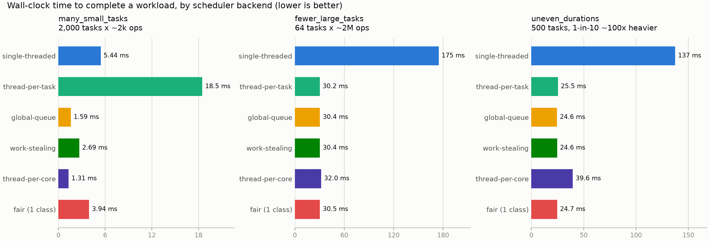
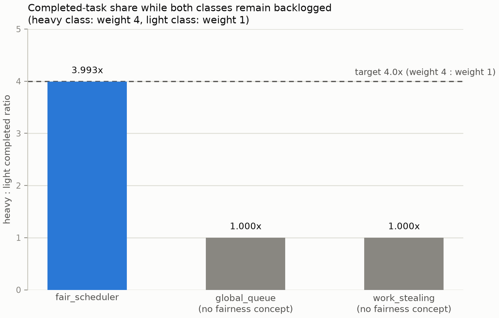

# Concurrent Task Schedulers

[](https://en.cppreference.com/w/cpp/20)
[](https://cmake.org)
[](LICENSE)
[](https://github.com/google/googletest)
[](https://github.com/google/benchmark)

A from-scratch C++20 task scheduling library: **four interchangeable scheduler backends** — work-stealing, a single mutex-guarded global queue, thread-per-core, and a CFS-inspired fair scheduler — built behind one shared `Scheduler` interface, plus panic-safe task handles, cooperative cancellation, and a benchmark suite that measures all four against each other and against two naive baselines.

This is not meant to replace mature libraries such as Intel TBB, folly, or Seastar. It's a learning-focused implementation of the mechanisms behind CPU task runtimes and scheduling policy — a Chase-Lev work-stealing deque, a virtual-runtime fair scheduler, thread affinity — built to be read, benchmarked, and reasoned about. (This project began as a Rust implementation of the work-stealing scheduler alone; that version is preserved at the [`rust-final`](https://github.com/czhao-dev/work-stealing-scheduler/tree/rust-final) tag.)

## Overview

`wss` starts every worker thread once and keeps it alive for the life of the scheduler. Tasks are short-lived closures scheduled through whichever backend you choose:

* a single abstract **`Scheduler`** interface (`submit` / `shutdown` / `metrics` / `worker_count`) that all four backends implement, so callers and the benchmark suite can drive any of them polymorphically through a `Scheduler&` or `std::vector<std::unique_ptr<Scheduler>>`
* **`WorkStealingScheduler`** — per-priority Chase-Lev work-stealing deques, one per worker, with global per-priority injectors and peer-to-peer stealing
* **`GlobalQueueScheduler`** — a single mutex-guarded FIFO queue, the deliberately naive baseline the others are measured against
* **`ThreadPerCoreScheduler`** — one OS thread per core, best-effort pinned, each with a private queue and **no stealing at all**
* **`FairScheduler`** — a CFS-inspired virtual-runtime scheduler over named, weighted classes, using `std::multimap` as the dispatch-ordering structure
* task submission with panic-safe result handles (`wss::spawn`, `JoinHandle<T>`)
* three priority classes (honored by `WorkStealingScheduler`, optionally `ThreadPerCoreScheduler`)
* cooperative cancellation via a shared, pollable token
* runtime counters (submitted / completed / panicked / stolen)
* a benchmark suite comparing all four backends (plus two naive baselines) across three CPU-bound workloads and a dedicated fairness workload

## Repository Layout

```text
work-stealing-scheduler/
├── CMakeLists.txt              # top-level: C++20, options, WSS_SANITIZE
├── cmake/                      # Warnings.cmake, Sanitizers.cmake
├── include/wss/
│   ├── job.hpp                  # UniqueFunction (move-only type-erased callable)
│   ├── result.hpp                # Result<T, JoinError>
│   ├── join_handle.hpp            # JoinHandle<T> / ResultSetter<T>
│   ├── priority.hpp
│   ├── cancellation.hpp
│   ├── metrics.hpp
│   ├── idle_signal.hpp             # atomic-generation doorbell
│   ├── chase_lev_deque.hpp          # header-only, Lê et al. 2013
│   ├── injector.hpp                  # per-priority mutex+deque global queue
│   ├── affinity.hpp                   # pin_to_core() platform facade
│   ├── scheduler.hpp                   # Scheduler interface, SubmitOptions, spawn()
│   ├── work_stealing_scheduler.hpp
│   ├── global_queue_scheduler.hpp
│   ├── thread_per_core_scheduler.hpp
│   └── fair_scheduler.hpp
├── src/                         # .cpp bodies (affinity_linux/macos/stub.cpp)
├── tests/                       # GoogleTest, one binary per file, FetchContent
├── benchmarks/                  # Google Benchmark, one binary, FetchContent
│   └── plots/                   # results.json + generate_plots.py (matplotlib) -> README PNGs
└── examples/
    ├── basic_pool.cpp
    ├── task_handle.cpp
    ├── priority_tasks.cpp
    ├── thread_per_core.cpp
    └── fair_scheduler.cpp
```

## Architecture

```text
                     Scheduler (abstract interface)
              submit(Job, SubmitOptions) / shutdown()
                    metrics() / worker_count()
                              ▲
      ┌───────────────┬───────┴────────┬────────────────────┐
      │               │                │                    │
WorkStealing     GlobalQueue     ThreadPerCore           Fair
Scheduler        Scheduler       Scheduler              Scheduler
(per-priority    (single mutex-  (N pinned threads,     (CFS-inspired
 Chase-Lev        guarded FIFO    private per-core       vruntime over
 deques +         queue, no       queues, NO             weighted
 injectors +      stealing)       stealing at all)        classes)
 stealing)
```

`wss::spawn(scheduler, f, opts)` and `wss::spawn_cancellable(scheduler, token, f, opts)` are free function templates, not scheduler methods: they build the `Job` + `JoinHandle<T>` machinery — including exception-catching and panic accounting — exactly once, then call the single virtual `submit()`. No backend duplicates that plumbing. `SubmitOptions` is a small struct carrying every backend-specific hint (`priority`, `core_hint`, `class_name`, `weight`); each backend reads only the fields it understands and ignores the rest.

## Core primitives

### `Job` (`job.hpp`)

A hand-written move-only type-erased callable (`UniqueFunction`), not `std::function`. `std::function` requires `CopyConstructible` captures — forcing every task closure's state through `shared_ptr` wrappers just to satisfy that would be a real deviation from the "one-shot task" model this project is built around. No small-buffer optimization in v1: allocation cost is one heap box per task, kept simple on purpose.

### Chase-Lev work-stealing deque (`chase_lev_deque.hpp`)

Implements the algorithm from Lê, Pop, Cohen & Nardell, *"Correct and Efficient Work-Stealing for Weak Memory Models"* (PPoPP 2013) — the same family of algorithm crossbeam-deque (and this project's original Rust implementation) is built on.

**Slot representation.** Each slot stores a heap-boxed `T*`, not a `T` by value. The original algorithm — and crossbeam-deque — stores `T` in-place and relies on a carefully-justified *benign* data race: a losing thread's non-atomic read of a contested slot is formally sound under Rust's memory model given the right unsafe reasoning. Reproducing that argument for a non-trivially-copyable, move-only `T` in C++ without the same tooling to check it is a much larger undertaking than this project's scope justifies. Boxing each element instead means every slot access is a well-defined atomic pointer load/store — trading one extra heap allocation per task for the guarantee that no slot access can ever be undefined behavior.

**A real bug, found by the tooling it was built to survive.** The first version of `push()` used a raw `atomic_thread_fence(release)` plus a *relaxed* store to the `bottom` index to publish a newly-boxed item, reasoning that the fence "covered" the slot write that preceded it. ThreadSanitizer disagreed — and was right to: TSan's race detector primarily proves soundness through matching acquire/release pairs on the *same* atomic object, and a fence protecting a *different* atomic than the one a stealer actually reads is real, valid-per-standard, but exactly the kind of subtle cross-object synchronization that's easy to get wrong and hard to verify. The fix was to make the slot's own store `release` and the stealer's own load `acquire` — a direct pair on the same atomic, provably correct and directly checkable by the tooling. `ChaseLevDequeTest.ConcurrentStealersAndOwnerNeverDuplicateOrDropItems` — 8 concurrent stealers racing an owner over 200,000 items — is what caught it; it and the rest of the concurrency-sensitive test suite now run clean under TSan and ASan/UBSan as a required gate, not an optional extra.

**Memory reclamation.** Growing allocates a new, larger backing buffer and publishes it, but the *old* buffer is never freed while the deque is alive — only at destruction. This is sound because a `steal()` call can only ever be made while the deque's owning worker thread is still running; workers are joined (and their deques destroyed with them) only after shutdown, by which point no thread can hold a reference into this deque. This sidesteps the classic Chase-Lev reclamation hazard without hazard pointers or a hand-rolled epoch scheme. The cost is bounded-but-retained memory: a deque that grows from 256 to 1,000,000 entries retains about a dozen buffers total (capacity doubles each time), not one per steal.

### The global injector (`injector.hpp`)

A mutex + `std::deque<Job>` per priority level, not a lock-free MPMC structure. This matches `GlobalQueueScheduler`'s own design philosophy, and avoids reimplementing crossbeam's nontrivial segmented `Injector` for what is, by design, the *cold path*: a worker only reaches the injector once its own local deque and every peer's local deque have come up empty. `pop_batch_into(dest, max_batch)` moves a batch of jobs directly into the caller's local deque in one critical section — the same idea as crossbeam's `steal_batch_and_pop`, amortizing lock cost over several tasks and giving the destination cache-friendly, contention-free access to that work on subsequent local pops.

### `Result<T, JoinError>` and `JoinHandle<T>` (`result.hpp`, `join_handle.hpp`)

C++ has no `catch_unwind`; a task body that throws is caught via `try { ... } catch (...) { ... }` and delivered through the handle rather than propagating across the scheduling boundary. Rather than rethrowing from `join()` (the `std::future`-style idiom), this project uses a hand-written `Result<T, JoinError>` variant, mirroring the original Rust API directly: `join()` stays non-throwing by default, with `rethrow_if_error()` as an escape hatch for callers who'd rather propagate via exceptions. `Result<void>` is an explicit template specialization — `std::variant<void, JoinError>` is ill-formed, so a void-returning task needs its own layout.

### The idle-wait doorbell (`idle_signal.hpp`)

Replaces a Condvar-plus-polling-timeout design (needed in the original Rust version to guard against a missed-wakeup race) with a `std::atomic<uint64_t>` generation counter and C++20's futex-backed `wait()`/`notify_all()`. No timeout fallback is needed at all, as long as callers follow the snapshot-before-check pattern:

```cpp
auto gen = idle.current();                    // snapshot BEFORE the final task search
if (auto job = find_task(...)) { run(job); continue; }
if (should_stop()) break;
idle.wait(gen);                                // no-op if gen already advanced past this
```

If a producer calls `notify()` any time after the snapshot, `wait()` observes a changed generation and returns immediately instead of blocking — there is no window in which a wakeup can be silently missed. This is validated directly by a multi-producer/multi-consumer stress test run under ThreadSanitizer. `GlobalQueueScheduler` deliberately does *not* adopt this doorbell, keeping a plain `std::mutex` + `std::condition_variable` instead — part of its value as a baseline is contrasting "simplest possible design" against the more sophisticated doorbell used everywhere else.

## The four schedulers

### `WorkStealingScheduler`

Each worker owns three local Chase-Lev deques (High / Normal / Background) plus a share of three global per-priority injectors. A worker looking for work runs the same three-stage search at every step, in priority order: **own local queues**, then **global injectors** (a batch pull that also seeds the local deque), then **peer workers' local deques** (a direct single-item steal). An `AtomicUsize`-equivalent pending counter — incremented on submit, decremented only after a job's body finishes running — means a task that spawns children from inside itself can never race a shutdown into stopping early.

### `GlobalQueueScheduler`

One `std::mutex` + `std::condition_variable` + `std::deque<Job>`. No local queues, no stealing, no priority. Exists purely so the benchmark suite has something architecturally simple to measure everything else against.

### `ThreadPerCoreScheduler`

*N* worker threads, each pinned best-effort to a distinct core, each with a **private** per-priority queue. A task is assigned to a core at submit time — an explicit `SubmitOptions::core_hint`, or round-robin if unset — and **never migrates afterward**. There is no stealer type at all in this backend, so `metrics().tasks_stolen` is a *structural* zero, not an empirically-observed one; `ThreadPerCoreSchedulerTest.TasksNeverMigrateFromTheirAssignedCore` proves it directly for every task in a 2,000-task run, not just on average.

**Affinity is best-effort, and the README says so honestly.** On Linux, `pthread_setaffinity_np` is a hard pin, enforced by the kernel scheduler. On macOS, `thread_policy_set(THREAD_AFFINITY_POLICY)` is a *hint* the kernel scheduler is free to ignore — there is no supported hard-pinning API on macOS at all, and Apple Silicon in particular gives no guarantee whatsoever via this mechanism. Any other platform falls back to a no-op stub. Crucially, the scheduler's **correctness** invariant (a task never runs on a different logical core than the one it was assigned to) does not depend on affinity working at all — it comes entirely from software queue separation, since each worker thread only ever looks at its own core's queue. Affinity only affects whether that logical core actually stays resident on one physical core, which is a cache-locality optimization, not a correctness requirement.

### `FairScheduler`

A CFS-inspired virtual-runtime scheduler over named, weighted classes. Because task closures are opaque and non-preemptible — there is no way to interrupt one mid-execution the way the Linux kernel preempts a running thread — vruntime only ever advances *after* a task completes: `vruntime += elapsed_wall_seconds / weight`, measured with `steady_clock`. Dispatch always picks the class with the smallest vruntime, via `std::multimap<double, ClassId>` (per this project's explicit design goal of using an ordered structure, not a heap or a lock-free skip list).

**Dispatch model: bounded staleness, multi-worker.** At most one live map entry exists per class at a time — but a class is immediately re-enqueued at its *current* vruntime as soon as a worker dequeues a task from it, if more work remains, rather than waiting for that task to actually finish. This lets several idle workers pick up the same class concurrently (good utilization) at the cost of a small, self-correcting staleness: an entry sitting in the tree can be up to `num_workers` tasks "behind" the class's true vruntime, since sibling in-flight tasks haven't completed and updated it yet. This was chosen over two simpler alternatives: strict single-flight (only one task per class in flight pool-wide) idles most workers whenever few classes are backlogged; a naive "one entry per task, frozen at submission-time vruntime" model lets a submission burst monopolize the CPU before its vruntime can rise, defeating the point of the scheduler. The staleness this design accepts instead self-corrects the next time that same entry is dispatched — it is a documented approximation, not a bug swept under the rug.

**New (or reawakened) classes are seeded near the current floor, not zero.** A `min_vruntime_` floor tracks the largest vruntime any class has been dispatched at so far. A class transitioning from empty to non-empty — whether it's brand new or was previously fully drained — has its vruntime clamped up to that floor before it can be dispatched. Without this, a fresh class starting at vruntime 0 would dominate a pool where other classes have already advanced, indefinitely; `FairSchedulerTest.NewClassIsSeededNearTheCurrentFloorNotZero` checks this directly, not just as a side effect of another test.

## Benchmarks

Measured with Google Benchmark on an Apple M3 (8 cores), Apple Clang 21 (C++20), release profile (`-O3`, IPO/LTO enabled for the library and the benchmark binary — matching the original Rust profile's `opt-level = 3, lto = true`). Each task body is a busy loop seeded per-task so the optimizer can't fold repeated calls into a constant — see [`benchmarks/scheduler_bench.cpp`](benchmarks/scheduler_bench.cpp). Reproduce with:

```bash
cmake -S . -B build-release -DCMAKE_BUILD_TYPE=Release -DWSS_BUILD_BENCHMARKS=ON -DWSS_BUILD_TESTS=OFF -DWSS_BUILD_EXAMPLES=OFF
cmake --build build-release -j
./build-release/benchmarks/scheduler_bench
```

The plots below are regenerated from a JSON dump of the same run, via [`benchmarks/plots/generate_plots.py`](benchmarks/plots/generate_plots.py) (matplotlib):

```bash
./build-release/benchmarks/scheduler_bench --benchmark_out=benchmarks/plots/results.json --benchmark_out_format=json
python3 benchmarks/plots/generate_plots.py
```

### Methodology and how to read the numbers

Google Benchmark doesn't run each case once — for each row it repeats the timed body until at least `--benchmark_min_time` (0.5s here) of cumulative wall time has elapsed, then reports the **mean per-iteration time**. That's why iteration counts vary wildly across rows and are themselves informative: `many_small_tasks/thread_per_core` ran **1,975 iterations** (each iteration cheap, ~1.5ms, so it takes many reps to fill 0.5s) while `fewer_large_tasks/single_threaded` ran only **4** (each iteration alone costs 175ms). More iterations of a cheap benchmark is not weaker evidence than fewer iterations of an expensive one — both are calibrated to the same statistical budget.

The **`CPU`** column is intentionally omitted from the tables below and is worth explaining rather than just dropping silently: Google Benchmark's `CPU` time only measures the *invoking* thread — the one running the `for (auto _ : state)` loop, which for every pooled strategy here spends most of its time blocked inside `JoinHandle::join()`'s condition-variable wait, not doing CPU work. For `fewer_large_tasks/global_queue`, for instance, `Time` was 30.9ms but `CPU` was only **0.095ms** — not because the work was nearly free, but because virtually all of that 30.9ms of wall time was spent on the pool's *worker* threads grinding through eight 2-million-iteration busy loops on other cores, invisible to the benchmarking thread's own CPU accounting. `Time` (wall clock) is the number that reflects what a caller actually experiences, so it's the one reported here.

<picture>
  <source media="(prefers-color-scheme: dark)" srcset="benchmarks/plots/latency_by_workload_dark.png">
  
</picture>

| Workload | single-threaded | thread-per-task | global-queue | work-stealing | thread-per-core | fair (1 class) |
| --- | --- | --- | --- | --- | --- | --- |
| `many_small_tasks` (2,000 × ~2k ops) | 5.43 ms (n=129) | 18.8 ms (n=36) | **1.78 ms** (n=836) | 3.12 ms (n=351) | **1.49 ms** (n=1975) | 3.49 ms (n=282) |
| `fewer_large_tasks` (64 × ~2M ops) | 175 ms (n=4) | 31.1 ms (n=100) | 30.9 ms (n=100) | 30.7 ms (n=100) | 34.0 ms (n=100) | 31.4 ms (n=100) |
| `uneven_durations` (500 tasks, 1-in-10 ~100x heavier) | 138 ms (n=5) | 26.3 ms (n=100) | 24.7 ms (n=1000) | 26.0 ms (n=1000) | **39.9 ms** (n=100) | 24.8 ms (n=1000) |

(`n` = iteration count Google Benchmark chose to reach 0.5s of cumulative measurement per row.)

| `fairness_under_class_skew` (heavy weight=4 vs. light weight=1, measured while both remain backlogged, n=10 each) | heavy completed | light completed | ratio | target |
| --- | --- | --- | --- | --- |
| `fair_scheduler` | 1,606 | 402 | **3.995** | 4.0 |
| `global_queue` (no fairness concept) | 1,006 | 1,005 | 1.001 | — |
| `work_stealing` (no fairness concept) | 1,004 | 1,004 | 1.000 | — |

<picture>
  <source media="(prefers-color-scheme: dark)" srcset="benchmarks/plots/fairness_under_class_skew_dark.png">
  
</picture>

**What this shows:**

* **Thread-per-task is still the clear loser for many small tasks** — 18.8ms vs. 1.5–3.5ms for every pooled strategy, a **12.6x** gap against the fastest (`thread_per_core`). OS thread creation cost dominates once individual tasks are cheap — exactly the problem fixed-size pools exist to solve — and this gap only widens as task count grows, since it's a fixed per-task cost, not an amortized one.
* **`thread_per_core` wins the uniform-workload case and loses the skewed one — by design.** It's fastest on `many_small_tasks` (1.49ms — **3.65x** faster than single-threaded, best of all six strategies: no stealing machinery, maximal cache locality, nothing to synchronize across cores at all) but *worst* on `uneven_durations` (39.9ms — **1.6x slower** than `global_queue`'s 24.7ms on the same workload, and slower even than `thread_per_task`): once a heavy task lands on a core via round-robin, nothing can rebalance it off, and that core's queue backs up behind it while the other seven idle. This is the exact tradeoff the architecture section predicts, not a coincidence — it's the whole reason to benchmark it against a scheduler that *can* rebalance. (It's still **3.5x** faster than not parallelizing at all — losing the skew comparison doesn't mean losing to single-threaded execution.)
* **`global_queue` remains a genuinely strong baseline**, not a strawman: it's competitive with or faster than `work_stealing` in every workload measured here, at 8 workers and these task counts. Work-stealing's advantage is about avoiding starvation under contention and skew that a single mutex doesn't reproduce cleanly in a clean, repeated-trial benchmark loop — the same finding as the original Rust benchmarks, now reproduced independently in the C++ port.
* **For CPU-bound work large enough to amortize scheduling overhead, all five threaded strategies converge** (~31–34ms on `fewer_large_tasks`, all within a few percent of each other) — the work itself, not the scheduler, is the bottleneck there. `work_stealing`'s 30.7ms against single-threaded's 175ms is a **5.7x** speedup on 8 cores — short of the theoretical 8x because of scheduling/synchronization overhead and non-parallelizable work, consistent with the original Rust project's own finding of "~6x from 8 cores after overhead."
* **`FairScheduler` achieves its actual purpose**: measured while both classes are still backlogged, the heavy class (weight 4) completes tasks at a **3.995:1** ratio against the light class (weight 1) — **99.9% of the configured 4:1 target**. `GlobalQueueScheduler` and `WorkStealingScheduler`, run through the identical submission pattern as a contrast baseline, land at 1.001:1 and 1.000:1 — neither has any concept of per-class fairness, so neither can produce anything but a coin-flip-fair split regardless of what weight is requested (they ignore `SubmitOptions::weight` entirely). This is the whole justification for the fourth scheduler existing, made concrete rather than asserted.

## Quick Start

```bash
git clone https://github.com/czhao-dev/work-stealing-scheduler.git
cd work-stealing-scheduler

cmake -S . -B build -DWSS_BUILD_TESTS=ON -DWSS_BUILD_EXAMPLES=ON
cmake --build build -j
ctest --test-dir build --output-on-failure    # 90 tests across 13 files

./build/examples/basic_pool
./build/examples/task_handle
./build/examples/priority_tasks
./build/examples/thread_per_core
./build/examples/fair_scheduler

# Release build with the benchmark suite:
cmake -S . -B build-release -DCMAKE_BUILD_TYPE=Release -DWSS_BUILD_BENCHMARKS=ON -DWSS_BUILD_TESTS=OFF -DWSS_BUILD_EXAMPLES=OFF
cmake --build build-release -j
./build-release/benchmarks/scheduler_bench

# Sanitizer builds (required gate for the hand-rolled concurrent primitives):
cmake -S . -B build-tsan -DWSS_SANITIZE=thread -DCMAKE_BUILD_TYPE=Debug -DWSS_BUILD_TESTS=ON
cmake --build build-tsan -j && ctest --test-dir build-tsan --output-on-failure

cmake -S . -B build-asan -DWSS_SANITIZE=address,undefined -DCMAKE_BUILD_TYPE=Debug -DWSS_BUILD_TESTS=ON
cmake --build build-asan -j && ctest --test-dir build-asan --output-on-failure
```

## Testing Strategy

90 tests across 13 files, run with `ctest`.

* **`primitives_test.cpp`, `chase_lev_deque_test.cpp`, `idle_signal_test.cpp`, `injector_test.cpp`** — the hand-rolled concurrent building blocks, tested in isolation before any scheduler is wired up. `ChaseLevDequeTest.ConcurrentStealersAndOwnerNeverDuplicateOrDropItems` and `IdleSignalTest.ManyProducersAndConsumersNeverMissAWakeup` are the two that specifically stress-test under TSan.
* **`basic_execution_test.cpp`, `shutdown_test.cpp`, `cancellation_test.cpp`, `work_stealing_test.cpp`, `stress_test.cpp`** — `WorkStealingScheduler`'s behavioral contract: results delivered, panics surfaced as `JoinError` without poisoning the pool, shutdown drains in-flight work, cooperative cancellation observed, priority honored under saturation, nested spawning from inside a task, concurrent multi-thread submission.
* **`global_queue_scheduler_test.cpp`** — the naive baseline's own contract, including a FIFO-ordering test specific to its single-queue design.
* **`thread_per_core_scheduler_test.cpp`** — `TasksNeverMigrateFromTheirAssignedCore` proves the no-migration invariant directly (every task, not an average), plus round-robin distribution and an affinity smoke test.
* **`fair_scheduler_test.cpp`** — equal-weight vruntime convergence, proportional share under weight skew (via progress-polling rather than fixed sleep windows, to stay robust under TSan/ASan slowdown), anti-starvation against a greedy backlogged class (via a fixed, bounded backlog rather than an unbounded producer thread, to keep the test fast and deterministic), and the new-class min-vruntime floor.
* **`scheduler_interface_test.cpp`** — a typed GoogleTest suite that runs the same submit/join/shutdown/metrics contract against all four backends through `Scheduler&`, catching any backend that doesn't honor the shared interface.

## Design Notes

**Fixed-size thread pool, always.** Spawning one OS thread per task is expensive — the `thread_per_task` benchmark result above pays for that directly, every time. A fixed-size worker pool bounds thread creation to startup and makes CPU usage predictable regardless of task count, across all four backends.

**Four schedulers, not a single "best" one.** Work-stealing isn't unconditionally best, and the benchmark numbers above prove it three different ways: `global_queue` matches or beats `work_stealing` on every workload measured; `thread_per_core` beats everything on uniform small tasks and loses to everything on skewed ones; and none of the other three can produce proportional fairness across weighted classes the way `fair_scheduler` does. A scheduler design should be measured against real, working alternatives — not assumed superior because it's more sophisticated, and not included as a strawman that loses by construction.

**Per-priority work stealing, not one shared queue, for `WorkStealingScheduler` specifically.** A single global queue is simple and, as the benchmarks show, often competitive — but it's a single point of contention with no answer for one worker ending up starved while another sits on a backlog. Per-worker local queues plus stealing keep the common case (a worker running off its own queue) contention-free while still rebalancing when work is unevenly distributed — precisely the situation `thread_per_core`'s benchmark result shows a single queue *and* a no-stealing design both handle worse than work-stealing.

**Cooperative, not forcible, cancellation.** Forcibly stopping a thread mid-task is unsound in the presence of locks, destructors, and unfinished writes. A pollable token lets a task decide when it's safe to stop, on its own terms.

**Fairness is measured mid-flight, not after full completion.** Every task submitted to any of these schedulers eventually runs — that's a liveness guarantee, not a fairness one. Waiting for a fixed backlog to fully drain and then comparing completed-task counts would show equal totals for every backend, `FairScheduler` included, because weight only affects *when* work gets done, not *whether* it does. The benchmark (and the corresponding test) instead measures completed-count share while both classes remain backlogged — the only point at which a scheduling *policy* difference is actually observable.

## C++ Concepts Used

* `std::jthread` for RAII auto-joining worker threads
* `std::atomic<T>::wait`/`notify_all` for futex-backed blocking without a hand-rolled Condvar+timeout doorbell
* explicit memory-order reasoning (`acquire`/`release`/`seq_cst`, `atomic_thread_fence`) in the Chase-Lev deque and the fair scheduler's dispatch loop
* move-only type erasure (`UniqueFunction`) instead of `std::function`
* `std::variant`-based `Result<T, E>` with an explicit `void` specialization
* polymorphism through an abstract `Scheduler` interface, with generic (`spawn`/`spawn_cancellable`) free-function templates built on top
* `std::exception_ptr` / `std::current_exception()` for panic-safe task results
* `std::multimap` as an ordered dispatch structure for the fair scheduler
* platform-conditional compilation (`#if defined(__linux__)` / `__APPLE__`) for thread affinity
* CMake `FetchContent` for GoogleTest and Google Benchmark, plus a `WSS_SANITIZE` option wired through every target for TSan/ASan/UBSan builds

## References

**Foundational papers**

- Blumofe, R. D. & Leiserson, C. E. (1999). Scheduling multithreaded computations by work stealing. *Journal of the ACM*, 46(5), 720–748. <https://dl.acm.org/doi/10.1145/324133.324234>
- Lê, N. M., Pop, A., Cohen, A., & Nardell, F. Z. (2013). Correct and efficient work-stealing for weak memory models. *Proceedings of the 18th ACM SIGPLAN Symposium on Principles and Practice of Parallel Programming (PPoPP '13)*, 69–80. <https://dl.acm.org/doi/10.1145/2442516.2442524>
- Chase, D. & Lev, Y. (2005). Dynamic circular work-stealing deque. *Proceedings of the 17th Annual ACM Symposium on Parallelism in Algorithms and Architectures (SPAA '05)*, 21–28. <https://dl.acm.org/doi/10.1145/1073970.1073974>

**Fair scheduling**

- The Linux kernel's Completely Fair Scheduler (CFS) — the vruntime/min_vruntime model `FairScheduler` adapts for non-preemptible task closures. <https://docs.kernel.org/scheduler/sched-design-CFS.html>

**Libraries and tooling**

- [Google Benchmark](https://github.com/google/benchmark) — the micro-benchmarking harness used here.
- [GoogleTest](https://github.com/google/googletest) — the unit-testing framework used here.
- [crossbeam-deque](https://docs.rs/crossbeam-deque) — the Chase-Lev deque implementation the original Rust version of this project was built on, and the direct reference point for this port's algorithm.
- [Rayon](https://github.com/rayon-rs/rayon) / [Tokio](https://tokio.rs) — production work-stealing schedulers; reference points for the design this project's `WorkStealingScheduler` learns from.
- [Seastar](https://seastar.io) / [Glommio](https://github.com/DataDog/glommio) — production thread-per-core runtimes; the reference architecture `ThreadPerCoreScheduler` is modeled on.

**C++ references**

- [cppreference](https://en.cppreference.com/) — `std::atomic`, memory ordering, `std::jthread`.
- Boehm, H-J. & Adve, S. V. (2008). Foundations of the C++ concurrency memory model. *PLDI '08*. The formal basis for the acquire/release reasoning throughout the Chase-Lev deque and fair scheduler.

## License

This project is licensed under the MIT License. See [LICENSE](LICENSE) for details.
